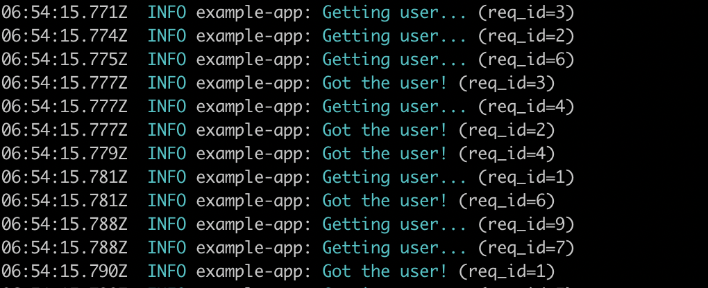
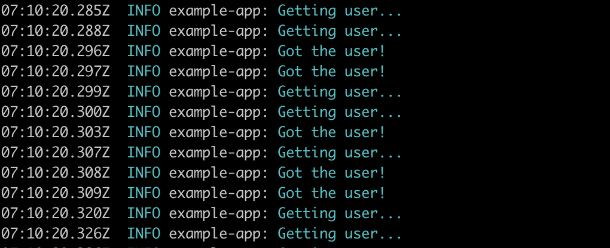

<div align="center">

<p>
Logging with context for Node.js
</p>
</div>


[](https://travis-ci.org/KTH/skog)

Skog is a Node.js library on top of Bunyan for logging:

1. **keep the context...**

    
    <details>
    <summary>Without context, you have unrelated log lines</summary><br>
    
    </details>

2. AND **keep the code clean**

    ```js
    async function getUser (/* No "log" parameter here! */) {
      skog.info('Getting user...')
      await sleep(Math.random() * 10)
      skog.info('Got the user!')
    }
    ```

    <details>
    <summary>Without Skog you need a `log` parameter or similar in `getUser`</summary><br>

    ```js
    async function getUser (log) {
      log.info('Getting user...')
      await sleep(Math.random() * 10)
      log.info('Got the user!')
    }
    ```

    </details>

## Features

- **Opinionated and familiar API**. Use *only* these conventional functions for logging: `fatal`, `error`, `warn`, `info`, `debug` and `trace`.
- **Lightweight**. [Less than 300 kB](https://packagephobia.now.sh/result?p=skog) mainly because Skog doesn't come with any logging library.
- **Flexible**. We offer functions specifically made for Bunyan out of the box, but you can use Skog with **any** logger library.

## Installation

Install `skog` with `npm install skog` (or use `yarn`)

## Usage

As early as possible in your application, require `skog` and set a logger. You can use whatever library you want. In this example, we use `pino`:

```js
const skog = require('skog')

skog.logger = require('pino')({ name: 'skog-with-pino' })
```

Then, in your modules, call the Skog functions like a regular library. Skog keeps track of the child loggers:

```js
const skog = require('skog')

async function getUser () {
  skog.info('Reading DB ')
  await longTask()
  skog.info('DB read!   ')
}
```

For real, it keeps track of the child loggers **without passing them everywhere**. For example, if you want to create one child logger per request, you just need to adjust the place where you actually create the logger:

```js
const skog = require('skog')

server.get(async function handleRequest (req, res) {
  // Here we are creating a child logger with a `req_id` field:
  await skog.child({ req_id: req.id }, async () => {
    // Inside this callback, `skog` is pointing to the child logger:
    skog.debug('<- Incoming request')

    // `getUser` will also use a logger that contains the `req_id` field
    const user = await getUser()

    skog.debug('-> Sending response')
    res.send(user)
  })
})
```

### Examples:

See the full example explained above, implemented in various ways:

- [With Bunyan](examples/bunyan.js). Here you can see the [log output](examples/bunyan.log)
- [With Pino](examples/pino.js).
- [With a custom logging library](examples/custom.js).
- You can compare with a version [using Bunyan children logging](examples/no-skog.js) and with the version [without any context at all](examples/no-req.js).


---

# API

Intentionally, the API of `skog/bunyan` is very very similar to `bunyan`. However, with Skog, **you don't create a "logger" instance**.

| Bunyan                           | Skog
|:---------------------------------|:----------
| `logger = bunyan.createLogger()` | `skog.createLogger()`
| `logger.info('hi')`, etc.        | `skog.info('hi')`, etc.
| `child = logger.child()`         | `skog.child()`

## `skog.createLogger(options)`

Sets up the global Skog instance (internally a Bunyan instance).

Accepts the same options as the [bunyan Constructor API](https://github.com/trentm/node-bunyan#constructor-api) but **without returning anything**:

```js
skog.createLogger({
  name: <string>,
  level: <level name or number>,

  // Any other fields are added to all log records as is.
  foo: 'bar',
  ...
});
```

Skog internally will call the Bunyan constructor so you can pass any accepted option by Bunyan. For example, serializers:

```js
const bunyan = require('bunyan')
const skog = require('skog/bunyan')

skog.createLogger({
  name: 'my-app',
  serializers: bunyan.stdSerializers
})
```

## `skog.fatal()`, `skog.info()`...

The `skog/bunyan` logging API is a subset of the `bunyan` logging API. The following methods are equivalent in Skog and Bunyan and accept the same parameters.

 Bunyan                      | Skog
|:---------------------------|:----------
| `logger.trace('hi')`       | `skog.trace('hi')`
| `logger.debug('hi')`       | `skog.debug('hi')`
| `logger.info('hi')`        | `skog.info('hi')`
| `logger.warn('hi')`        | `skog.warn('hi')`
| `logger.error('hi')`       | `skog.error('hi')`
| `logger.fatal('hi')`       | `skog.fatal('hi')`

**Warning**. Remember to call `skog.createLogger` before you call these functions. Right now, we are still thinking on how Skog should behave if you don't call `skog.createLogger` (throw an error, use a default logger...?) so do not assume any behavior upon this.

*Other bunyan methods (like custom levels) are not implemented.*

## `skog.child(options, callback)`

The `.child` method replaces the original `logger.child` method in Bunyan. In Skog you pass a `callback` to the `child` function. When you call `skog` inside the callback, it will call the child logger.

For example, imagine that you want to use a different child logger for every request in an Express server:

```js
const skog = require('skog/bunyan')
skog.createLogger({ name: 'my-app' })

server.get(async function handleRequest (req, res) {
  // Here we are creating a child logger with a `req_id` field
  await skog.child({ req_id: req.id }, async () => {
    // Inside this callback, `skog` is pointing to the child logger:
    skog.debug('<- Incoming request')

    skog.debug('-> Sending response')
    res.send(user)
  })
})
```

As you can see in the example, you can pass both a synchronous or an async function.

<details>
<summary>Explanation</summary>

Whatever you return in the callback function, it will be returned by `skog.child`:

```js
const a = skog.child(options, () => {
  skog.info('inside')
  return 5
})

// Now `a` has a value of `5`
```

It means, that if you pass an async function as callback (a function that returns a Promise), the promise is returned by `skog.child` and you can `await` it:

```js
const a = skog.child(options, async () => {
  // This "callback" function returns a Promise because it is an async function
  skog.info('inside')
})


// Now "a" is the Promise returned by the callback:
await a
```

This means also that any error thrown by the callback is propagated outside of `skog.child`:

```js
try {
  await skog.child({}, async () => {
    throw new Error()
  })
} catch (err) {
  // Here we get the "Error" thrown inside the callback
}
```

</details>
