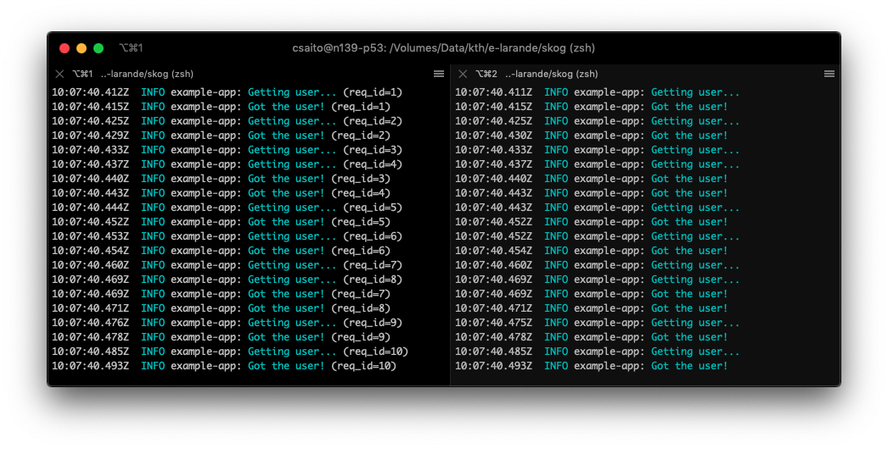

<div align="center">

<p>
Logging with context for Node.js
</p>
</div>


[](https://travis-ci.org/KTH/skog)

Skog is a Node.js library on top of Bunyan for logging:

1. **keep the context...**

    <div align="center">
    
    <p><i>(Left side with context, right without context)</i></p>
    </div>

2. AND **keep the code clean**

    ```js
    async function getUser (/* No "log" parameter here! */) {
      skog.info('Getting user...')
      await sleep(Math.random() * 10)
      skog.info('Got the user!')
    }
    ```

    <details>
    <summary>Without Skog you need a `log` parameter or similar in `getUser`</summary><br>

    ```js
    async function getUser (log) {
      log.info('Getting user...')
      await sleep(Math.random() * 10)
      log.info('Got the user!')
    }
    ```

    </details>

## Features

- **Opinionated and familiar API**. Use *only* these conventional functions for logging: `fatal`, `error`, `warn`, `info`, `debug` and `trace`.
- **Lightweight**. [Less than 300 kB](https://packagephobia.now.sh/result?p=skog) mainly because Skog doesn't come with any logging library.
- **Flexible**. We offer [functions specifically made for Bunyan](/examples/server/bunyan.js) out of the box, but you can use Skog with [**any** logger library](/examples/server/pino.js).
- **Silent when testing**. Want to silent the logs when executing in CI? [This is how you do it in Skog](/examples/testing/ava.js)

## Installation

Install `skog` with `npm install skog` (or use `yarn`)

## Usage with bunyan

1. Install Bunyan because it is not shipped with `skog`

    ```
    npm i bunyan
    ```

2.  As early as possible in your application, require `skog/bunyan` to initialize the logger

    ```js
    require('skog/bunyan').createLogger({
      name: 'my-app'
    })
    ```

    You can pass anything like you would do in the actual bunyan constructor:

    ```js
    require('skog/bunyan').createLogger({
      name: 'my-app',
      serializers: require('bunyan').stdSerializers
    })
    ```

3. Then, in your modules, call the Skog functions like a regular library. Skog keeps track of the child loggers:

    ```js
    const skog = require('skog')

    async function getUser () {
      skog.info('Reading DB ')
      await longTask()
      skog.info('DB read!   ')
    }
    ```

----

For real, it keeps track of the child loggers **without passing them everywhere**. For example, if you want to create one child logger per request, you just need to adjust the place where you actually create the logger:

```js
const skog = require('skog')

server.get(async function handleRequest (req, res) {
  // Here we are creating a child logger with a `req_id` field:
  await skog.child({ req_id: req.id }, async () => {
    // Inside this callback, `skog` is pointing to the child logger:
    skog.debug('<- Incoming request')

    // `getUser` will also use a logger that contains the `req_id` field
    const user = await getUser()

    skog.debug('-> Sending response')
    res.send(user)
  })
})
```

----

## Recipes

### With Express

[Example with Express](examples/express/)


### Node.js server application

[Example of a server application](examples/server/)

- [With Bunyan](examples/server/bunyan.js).
- [With Pino](examples/server/pino.js).
- [With a custom logging library](examples/server/custom.js).

### Skog during testing

When testing and in CI environments, you might not want to use Bunyan since it puts **too much** information to the logs.

[The example on executing Skog when testing](examples/testing/README.md) shows how can you integrate Skog with testing libraries:

- [With AVA](examples/testing/ava.js)
- [With Mocha](examples/testing/mocha.js)
